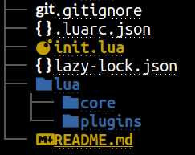

# My neovim config README シ 

(WORK IN PROGRESS 👀)

# Table of Contents

- [Requirements](#Requirements)
- [My dirs settings](#My-dirs-settings)
- [Base plugins](#Base-plugins)
    - [Package manager](#Package-manager))
    - [neo-tree](#neo-tree)
    <!-- - [treesitter](#treesitter) -->
    <!-- - [lsp, cmp, mason](#lsp-cmp-mason) -->

# Requirements

- [Nerd Fonts](https://www.nerdfonts.com/font-downloads) - to show icons
- Neovim 0.10+
- Git 2.43+
- [Nodeand and npm](https://timeweb.cloud/tutorials/nodejs/kak-ustanovit-node-js-v-ubuntu-22-04) - to use markdown-preview and install language servers and debug adapters with [mason.nvim.](https://github.com/williamboman/mason.nvim)
- [xclip](https://linuxconfig.org/how-to-use-xclip-on-linux) - to copy from neovim to main buffer
- [ripgerp](https://github.com/BurntSushi/ripgrep) - to search with [telescope.nvim](https://github.com/nvim-telescope/telescope.nvim)
- [cargo](https://github.com/rust-lang/cargo) - to replace something with [nvim-spectre](https://github.com/nvim-pack/nvim-spectre)
- [obsidian](https://help.obsidian.md/Getting+started/Download+and+install+Obsidian) - you need obsidian for note and change workspace dir in [obsidian-nvim.lua](https://github.com/aragami3070/nvim/blob/master/lua/plugins/obsidian-nvim.lua) (or remove obsidian.nvim plugin)
- [browser-sync](#web-tools) - to use veb tools

# My dirs settings

init.lua - to use all config from other plugins. 

In core/ I have:
- [plugins.lua](https://github.com/aragami3070/nvim/blob/master/lua/core/plugins.lua) for write installation all plugins that I use
- [keymaps.lua](https://github.com/aragami3070/nvim/blob/master/lua/core/keymaps.lua) for setup my keymaps
- [set.lua](https://github.com/aragami3070/nvim/blob/master/lua/core/set.lua) for setup neovim options
- [colors.lua](https://github.com/aragami3070/nvim/blob/master/lua/core/colors.lua) for setup my color theme

In plugins/ I have configs for installed plugins



# Base plugins

Base plugin (I think so)

## Package manager

<strong>lua/core/plugins.lua:</strong>

```Lua
-- Bootstrap lazy.nvim
local lazypath = vim.fn.stdpath("data") .. "/lazy/lazy.nvim"
if not (vim.uv or vim.loop).fs_stat(lazypath) then
  local lazyrepo = "https://github.com/folke/lazy.nvim.git"
  local out = vim.fn.system({ "git", "clone", "--filter=blob:none", "--branch=stable", lazyrepo, lazypath })
  if vim.v.shell_error ~= 0 then
    vim.api.nvim_echo({
      { "Failed to clone lazy.nvim:\n", "ErrorMsg" },
      { out, "WarningMsg" },
      { "\nPress any key to exit..." },
    }, true, {})
    vim.fn.getchar()
    os.exit(1)
  end
end
vim.opt.rtp:prepend(lazypath)

-- Make sure to setup `mapleader` and `maplocalleader` before
-- loading lazy.nvim so that mappings are correct.
-- This is also a good place to setup other settings (vim.opt)
vim.g.mapleader = " "
vim.g.maplocalleader = "\\"

-- Setup lazy.nvim
require("lazy").setup({
    spec = {
        -- installation your plugins
    },
    checker = { enabled = true },
})
```

<strong>init.lua</strong>

```Lua
require('core.plugins')
```

## neo-tree

<strong>lua/core/plugins.lua:</strong>

```Lua
    -- File explorer
    {
        "nvim-neo-tree/neo-tree.nvim",
        branch = "v3.x",
        dependencies = {
            "nvim-lua/plenary.nvim",
            "nvim-tree/nvim-web-devicons", -- not strictly required, but recommended
            "MunifTanjim/nui.nvim",-- "3rd/image.nvim", -- Optional image support in preview window: See `# Preview Mode` for more information
        }
    }
```

<strong>lua/plugins/neo-tree.lua</strong>

```Lua
vim.fn.sign_define("DiagnosticSignError",
{text = " ", texthl = "DiagnosticSignError"})
vim.fn.sign_define("DiagnosticSignWarn",
{text = " ", texthl = "DiagnosticSignWarn"})
vim.fn.sign_define("DiagnosticSignInfo",
{text = " ", texthl = "DiagnosticSignInfo"})
vim.fn.sign_define("DiagnosticSignHint",
{text = "󰌵", texthl = "DiagnosticSignHint"})

require("neo-tree").setup({
    position = "right",
    filesystem = {
        filtered_items = {
            visible = true, -- This is what you want: If you set this to `true`, all "hide" just mean "dimmed out"
            hide_dotfiles = false,
            hide_gitignored = true,
        },
    }
})
```

<strong>init.lua</strong>

```Lua
require('plugins.neo-tree')
```

<strong>lua/core/keymaps.lua</strong>

```lua
-- NOTE: Added neo-tree short cut
vim.keymap.set("n", "<space>f", ":Neotree right<CR>", {desc = "Open Neotree Window"})
vim.keymap.set("n", "<space>r", ":Neotree close<CR>", {desc = "Close Neotree Window"})
vim.keymap.set("n", "<space>gs", ":Neotree git_status<CR>", {desc = "Open Neotree git_status Window"})
```

|    Vim Mode    |         Keymaps        |Description                                         |
| :------------: | :--------------------: | :------------------------------------------------: |
|     Normal     | '\<space>' + 'f'       | Open Neotree Window                                |
|     Normal     | '\<space>' + 'r'       | Close Neotree Window                               |
|     Normal     | '\<space>' + 'g' + 's' | Open Neotree git status Window                     |

<!-- ## treesitter -->

<!-- ## lsp cmp mason -->


## Markdown-preview
Need to run markdown-preview:

```
:Lazy build markdown-preview.nvim
```

## web-tools

need install to use html preview

```
npm install -g browser-sync
```

or if permision denied errors use sudo:

```
sudo npm install -g browser-sync
```

or this [Resolving EACCES permissions errors when installing packages globally](https://docs.npmjs.com/resolving-eacces-permissions-errors-when-installing-packages-globally)


